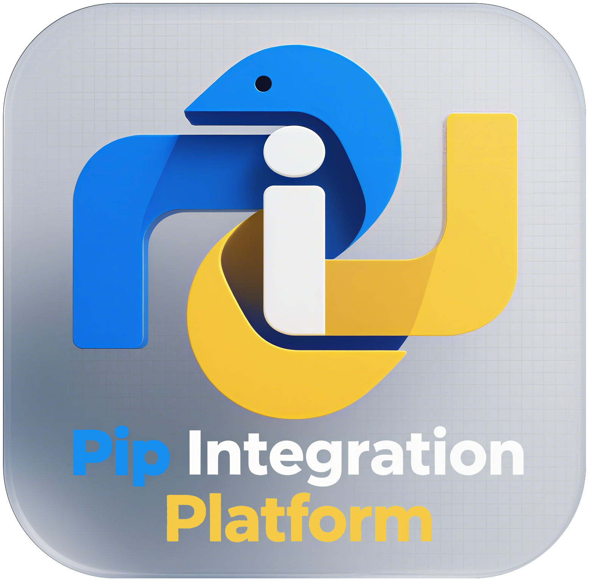

# Pip Integration Platform

</img>

使用python和tkinter（sv-ttk）编写的pip图形化管理器。

Pip Integration Platform（PIP）。

## 特点

- 无需打包，直接依靠现有各个python环境运行；
- 一键显示所有第三方库的版本、简介信息，并可打开选定库的网站和所在文件位置（如果有）；
- 选择第三方库后可便捷卸载；
- 便捷升级和安装指定库；
- 一键检测所有可升级库，并可选择第三方库进行升级；
- 分析第三方库的依赖项目和被依赖情况，一键显示所有顶层库（未被依赖的第三方库）；
- ……

## 运行

下载本项目后，使用pip安装`sv-ttk`，运行`main.py`即可。存在多个python环境时，PIP处理的库环境为解释器对应的环境。

## 使用

### 首页（库列表）

该页面显示所有已安装的第三方库，展示版本和简介信息。

通过下方的工具栏按钮，可以打开第三方库的文件位置（双击对应库有同样效果）和主页、卸载库、分析选定库的依赖关系。此外，可刷新本列表，以及获取所有可用更新。

### 升级&安装

此页面中，可以直接输入库名进行安装或选择更新。

输入框内回车执行安装。

### 卸载

此页面中，可直接输入库名进行卸载，也可以从首页选择第三方库进行卸载。

输入框内回车执行卸载。

### 检查更新

本页面提供检测所有可更新的第三方库列表，也可以从首页点击检查全部更新获取。选择可更新的库进行更新（双击库名有同样效果），将在**升级&安装**界面升级该库。

### 依赖分析

此页面中，可直接输入第三方库分析其依赖项目和依赖该库的其它第三方库，也可通过首页点击分析依赖使用该功能。

双击列表中的任何一个库名，将会填充到输入框并执行分析，分析结果会添加到当前选项下。既可以选择删除当前选中项所在的分析模块，也可以清空列表。

右侧可以列出所有最顶层的第三方库，即未被依赖的库。双击库名后，会填充到输入框。

输入框内回车执行依赖分析。

## 交互设计

每种任务的顺序都是线性的。

本软件所有任务均在线程池中运行，任何一个任务不影响使用本软件的其它功能。由于升级&安装、卸载、检查更新、依赖分析不太可能一起使用，因此线程池最大任务数设计为**3**个。可在`./lib/operate/pip_threads.py`中进行更改。
