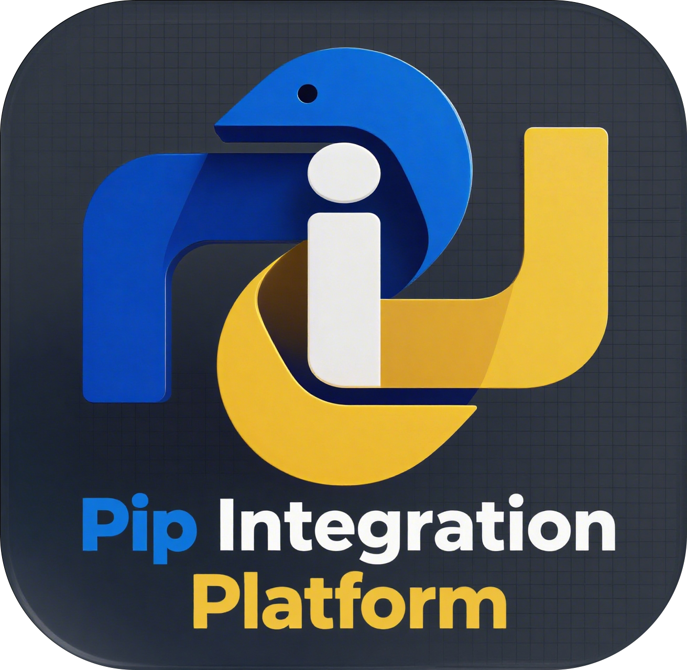

# Pip Integration Platform

</img>

A pip GUI manager written in python and tkinter (sv-ttk).

Pip Integration Platform (PIP).

## Features

- No packaging required; it can run directly relying on the existing python environments.
- One-click display of the version and brief introduction information of all third-party libraries, and open the website and file's location of the selected library (if any).
- After choosing a third-party library, it can be conveniently uninstalled.
- Convenient upgrade and installation of specified libraries;
- One-click detection of all upgradable libraries, and you can choose third-party libraries for upgrading.
- Analyze the dependent items and dependent status of third-party libraries, and display all top-level libraries (third-party libraries that are not required) with one click;
- The interface is modern and the operation is convenient
- ...

## Run

After downloading this project, install `sv-ttk` using pip and run `main.py`. When there are multiple python environments, the library environment processed by PIP is the corresponding environment of the interpreter.

## Usage

### Home Page (Packages)

This page displays all installed third-party libraries, showing their versions and brief introduction information.

Through the toolbar buttons below, you can open the file location of third-party libraries (double-clicking the corresponding library has the same effect), the home page, uninstall libraries, and analyze the dependencies of selected libraries. In addition, you can refresh this list and obtain all available updates.

### Install

On this page, you can directly enter the library name for installation or select from "Update" to upgrade.

Press Enter in the input box to execute the installation.

### Uninstall

On this page, you can directly enter the library name to uninstall it, or you can select a third-party library from the homepage to uninstall it.

Press Enter in the input box to uninstall.

### Update

This page provides a list of all updatable third-party libraries. You can also obtain it by clicking "Check all updates" on the homepage. Select the updatable library to update (double-clicking the library name has the same effect), and the library will be upgraded in the **Install** interface.

### Dependency

On this page, you can directly input third-party libraries to analyze their dependent items and other third-party libraries that depend on them. You can also use this function by clicking on "Dependency" on the homepage.

Double-click any library name in the list, and it will be filled into the input box and an analysis will be performed. The analysis result will be added under the current option. You can either choose to delete the analysis module where the currently selected item is located or clear the list.

All the top-level third-party libraries, that is, the libraries that are not relied upon, can be listed on the right side. After double-clicking the library name, it will be filled into the input box.

Press Enter in the input box to perform dependency analysis.

### Setting

On this page, you can set the application language and appearance. **All Settings will take effect after the software is restarted**.

## Interaction design

The sequence of each task is linear.

All tasks of this software run in the thread pool, and no task affects the use of other functions of this software. Since Install, Uninstall, Update checking, and Dependency analysis are unlikely to be used together, the maximum number of tasks in the thread pool is designed to be **3**. Changes can be made in `./lib/operate/pip_threads.py`.
