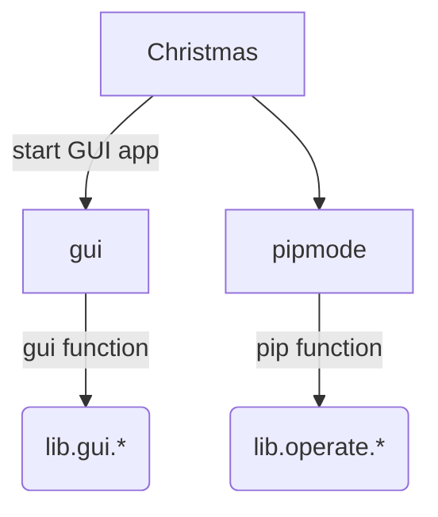

# Pip Integration Platform程序结构

## 组成部分

Pip Integration Platform（PIP）采用逻辑功能、界面控制、界面设计分离的结构，由`main.py`统一启动和控制。

### 逻辑功能

PIP的逻辑功能主要在`pipmode.py`，以及其下辖的`lib.operate.*`中，负责实现PIP的主要功能。

### 界面控制

PIP的界面控制主要在`gui.py`，以及其下辖的`lib.gui.*`中，负责PIP的功能交互。

### 界面设计

PIP的界面设计主要在`pages/*.xml`中，通过TinUIXml实现界面布局和呈现，通过`gui.py`接入交互逻辑。

---

## 控制与调用结构

### 功能内结构

PIP的逻辑功能和界面控制在代码层面，各自呈由上至下的管理与控制结构。

即在逻辑功能层面，由`pipmode.py`作为总接口，调用`lib.operate.*`实现具体功能；在界面控制层面，由`gui.py`作为界面载入总程序和总接口，同时调用`lib.gui.*`实现界面的交互。

### 交叉结构

PIP总结构如下：

显然，`lib.gui.*`是用户交互的核心，也是用户指令发出的起点。然而，用户指令需要通过`lib.operate.*`中的功能才能够真正实现。

PIP中，二级及以下结构的代码文件，只会调用一级结构代码文件，因此，`lib.gui.*`的指令信息会通过调用`pipmode.py`中的接口，由`pipmode.py`传递给`lib.operate.*`。

对于`lib.operate.*`中的界面回调控制，PIP设计为通过触发界面虚拟事件以及信息变量回调实现。
